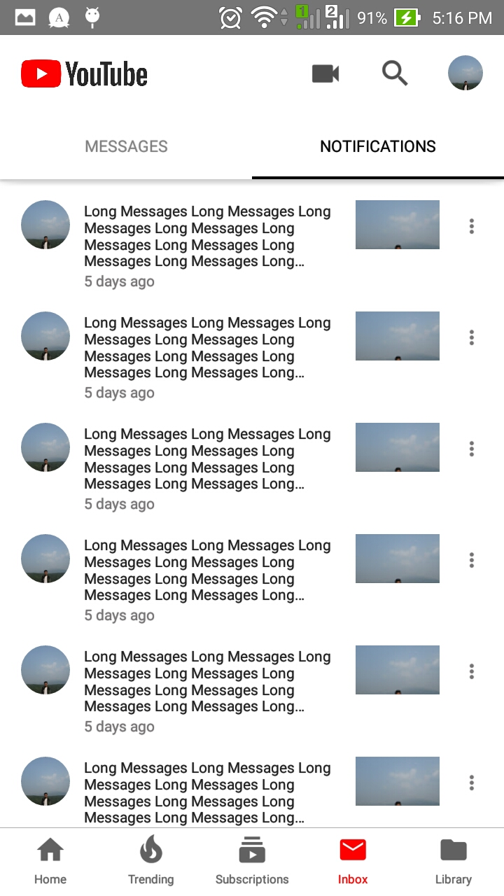

# youtube-clone-reactnative
Youtube App Clone Built with React Native

I don't have any of the image/icon/thumbnails in this project except my own photo. All rights goes to YouTube and I use it just for learning process.

**Screenshot:**

**Resource:**
- YouTube Logo, thumbnails/image is from YouTube.
- Transparent image
https://opengameart.org/content/transparency-background-checkerboard
- YouTube JSON API
"Coding is Love" YouTube Channel
https://www.youtube.com/watch?v=LdKtugH-sb8 